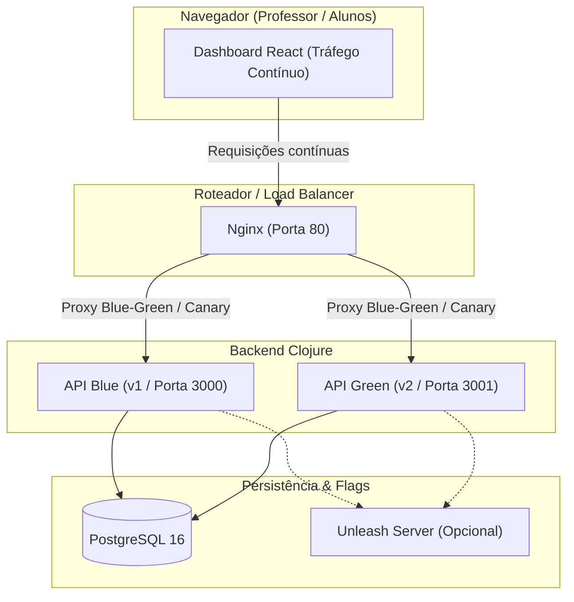

# Planejamento: Laboratório Prático de Entrega Contínua e Implantação (1 Hora)

## Visão Geral
Construção de uma aplicação completa, didática e containerizada para demonstrar as quatro estratégias do Guia de Estudos em uma aula prática de ~1 hora:
1. **Rolling Update** (Atualização gradual de réplicas com health checks)
2. **Blue-Green Deployment** (Ambientes paralelos e switch instantâneo)
3. **Canary Release** (Roteamento ponderado de tráfego com Nginx e observabilidade de métricas de erro)
4. **Feature Flags** (Desacoplamento de Deploy vs Release: embutido no app e via Unleash)

---

## Arquitetura e Decisões Técnicas

- **Orquestração**: Docker Compose + Nginx (proxy reverso com hot reload sem downtime).
- **Backend**: **Clojure** (Ring + Reitit + `next.jdbc` + `cheshire` para JSON).
- **Frontend**: **React** + **Tailwind CSS** + **Vite** (Dashboard interativo com requisições em tempo real, visualizador de tráfego v1 vs v2, taxas de erro e gerenciador de flags).
- **Banco de Dados**: **PostgreSQL 16** (com script de schema compartilhado).
- **Feature Flags**:
  - *Modo Local*: Gerenciado via atom/REST na própria API (ultra rápido, sem dependências).
  - *Modo Unleash*: Container do Unleash integrado para demonstrar ferramenta corporativa de mercado.
- **Automação**: **Makefile** e scripts Shell (`.sh`) para comandos de 1 linha durante a aula.



---

## Estrutura do Projeto

```text
projeto-arquitetura/
├── backend/
│   ├── deps.edn               # Dependências Clojure (Ring, Reitit, next.jdbc, etc.)
│   ├── src/
│   │   └── app/
│   │       ├── core.clj       # Servidor HTTP, rotas e handlers
│   │       ├── db.clj         # Conexão e queries PostgreSQL
│   │       └── flags.clj      # Lógica de Feature Flags (Local + Unleash)
│   ├── resources/
│   │   └── db/migration.sql   # Script SQL inicial
│   └── Dockerfile             # Multi-stage build com Temurin JRE
├── frontend/
│   ├── package.json
│   ├── vite.config.js
│   ├── tailwind.config.js
│   ├── src/
│   │   ├── App.jsx            # Dashboard principal com métricas em tempo real
│   │   ├── components/
│   │   │   ├── TrafficStream.jsx # Gráficos/indicadores de versão recebida
│   │   │   ├── FlagManager.jsx   # Alternador de Feature Flags
│   │   │   └── ChaosControls.jsx # Injetor de falhas para simular alertas
│   └── Dockerfile
├── nginx/
│   ├── nginx.conf
│   └── conf.d/
│       ├── blue-green.conf    # Upstream para Blue ou Green
│       └── canary.conf        # Upstream com pesos (split_clients / weights)
├── scripts/
│   ├── switch-blue.sh         # Vira tráfego para Blue
│   ├── switch-green.sh        # Vira tráfego para Green
│   ├── set-canary.sh          # Ajusta percentual de Canary (10%, 25%, 50%, 100%)
│   ├── trigger-failure.sh     # Simula falha na versão v2
│   └── rolling-update.sh      # Simula atualização rolling com réplicas
├── docker-compose.yml         # Compose principal (Nginx, Blue, Green, Frontend, Postgres)
├── docker-compose.unleash.yml # Compose complementar para o Unleash
├── Makefile                   # Comandos convenientes (make start, make blue, make canary-10, etc.)
└── AULA_ROTEIRO.md            # Guia passo a passo do instrutor para a aula de 1h
```

---

## Roteiro da Aula Prática (60 Minutos)

1. **00 - 10 min: Introdução e Subida do Ambiente**
   - Executar `make start`.
   - Abrir o dashboard no navegador (`http://localhost`).
   - Apresentar a diferença entre **Deploy vs Release** e o funcionamento do proxy reverso.
2. **10 - 22 min: Cenário 1 - Rolling Update**
   - Escalar réplicas com Docker (`docker compose up --scale api=3`).
   - Atualizar imagem/versão gradualmente, observando no dashboard que o tráfego nunca é interrompido (zero-downtime) graças aos readiness probes.
3. **22 - 35 min: Cenário 2 - Blue-Green Deployment**
   - Subir o ambiente Green (v2) em paralelo com novas cores/features.
   - Testar o Green isoladamente em porta interna.
   - Executar `make switch-green`: Nginx recarrega em 1 milissegundo e 100% dos usuários migram instantaneamente.
   - Simular um problema e executar `make switch-blue` (Rollback instantâneo).
4. **35 - 48 min: Cenário 3 - Canary Release**
   - Executar `make canary-10` (10% de tráfego para v2).
   - O gráfico do dashboard mostra visualmente a proporção 90/10 das requisições.
   - Injetar uma falha na v2 (`make trigger-fault`) -> O dashboard acusa alertas na fatia de 10% sem derrubar os 90% dos usuários.
   - Fazer rollback ou corrigir e avançar `make canary-50` -> `make canary-100`.
5. **48 - 60 min: Cenário 4 - Feature Flags**
   - Demonstrar o desacoplamento: v1 e v2 têm o código de uma funcionalidade ("Desconto VIP" ou "Novo Layout").
   - Ligar a flag no painel local instantaneamente, sem nenhum restart de container.
   - Exibir o painel do Unleash para mostrar como empresas gerenciam flags por regras e segmentação de usuários.

---

## Plano de Verificação

### Testes Automatizados e de Infraestrutura
- Verificar se todos os containers sobem sem erro: `docker compose up -d`.
- Testar endpoints do backend Clojure:
  - `curl -i http://localhost/api/health`
  - `curl -i http://localhost/api/version`
  - `curl -i http://localhost/api/features`
- Testar recarga do Nginx sem perda de requisições durante `make switch-green` e `make switch-blue`.
- Testar divisão ponderada de tráfego no Nginx durante `make canary-10`.
- Validar hot-toggle de Feature Flags na API Clojure.

---

## User Review & Confirmação
Por favor, revise o plano acima. Se estiver de acordo, confirme para iniciarmos a implementação de todos os componentes!
